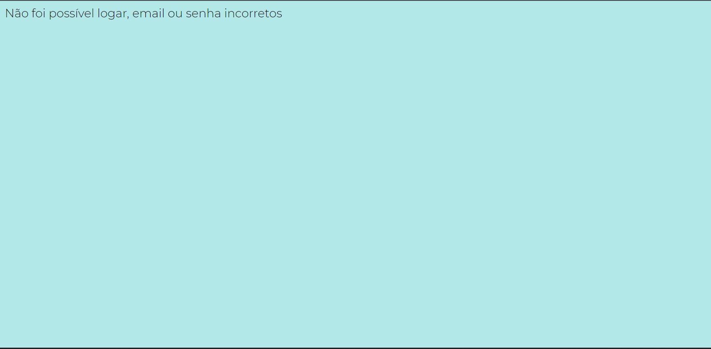
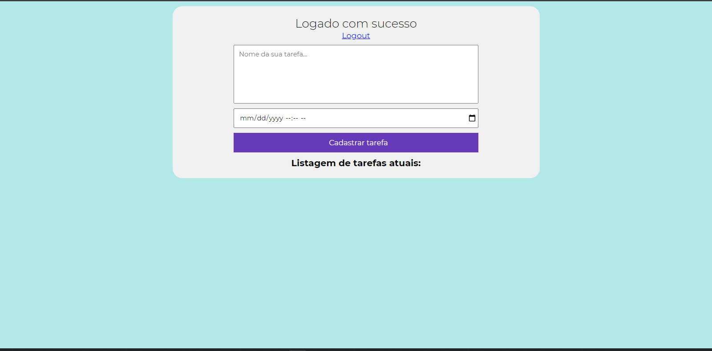
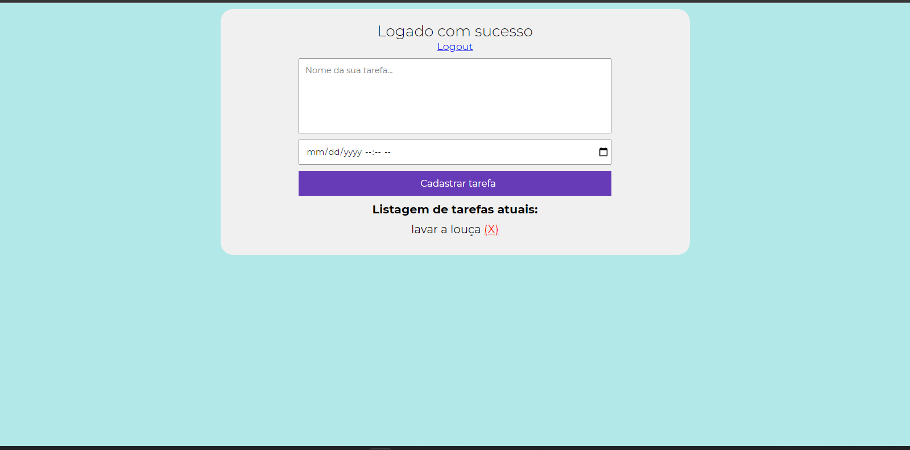

# Projeto Agenda

 
 

Projeto desenvolvido com o intuito de melhorar minhas habilidades com o firebase

Tecnologias utilizadas:
 - Firebase 
 - JavaScript 
 - CSS 
 - HTML

Nesse projeto eu consegui tirar do papel uma agenda que hoje em dia eu utilizo para me organizar nas tarefas do dia a dia